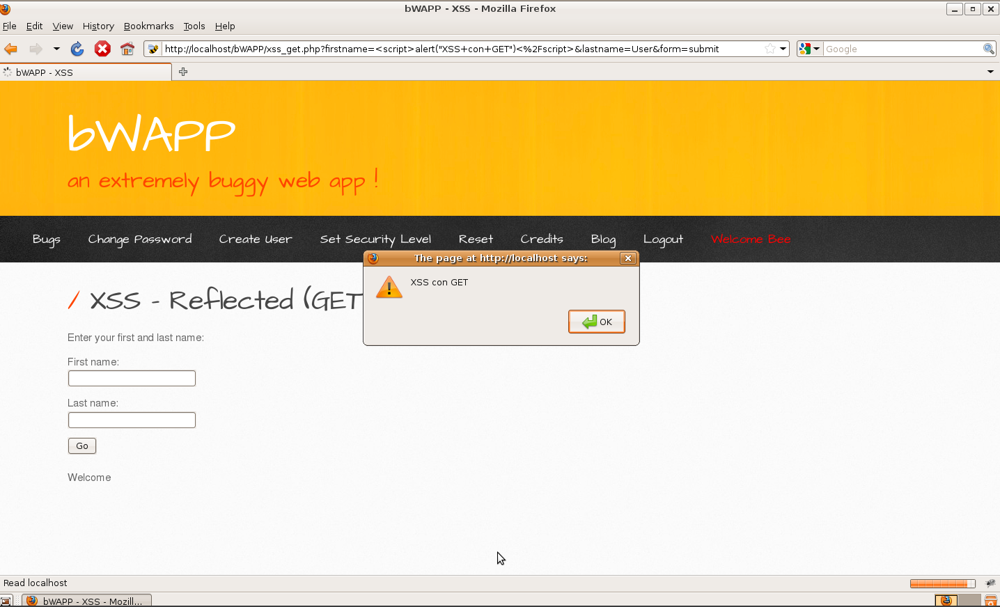

# Cross-Site Scripting (XSS) Reflected (GET) Exercise

1. Select the vulnerability **Cross-Site Scripting (XSS) Reflected (GET)**.
2. On the page that opens, you will see a form asking for First name and Last name. Enter any values in both fields, for example:

    ```bash
    First name: Test
    Last name: User
    ```

    

3. Upon submitting the form, you will see that the entered values are displayed as a message on the page and are also included in the URL as GET parameters. The URL will look something like this:

    ```bash
    http://localhost/bWAPP/xss_get.php?firstname=Test&lastname=User
    ```

    

### **Injecting the XSS Script into the Form**

1. Instead of regular values, enter the following script in either of the form fields to inject an XSS attack:

    ```bash
    First name: <script>alert('XSS with GET')</script>
    Last name: User (or any other value)
    ```

    

    When you submit the form, the script will execute, displaying an alert with the message "XSS with GET."

    

### **Verifying the Exploitation**

- Confirm Exploitation Results: Ensure that the page displays the alert correctly, confirming that the XSS injection was successful.

    > Note that with GET, the entered data is visible in the URL, making this method easier to exploit and share, but also more noticeable.


## **Cross-Site Scripting (XSS) Reflected (POST)**

1. Select the vulnerability **Cross-Site Scripting (XSS) Reflected (POST)**.
2. On the page that opens, you will see a form asking for First name and Last name. Enter the following script in either of the form fields to inject an XSS attack:

    ```bash
    First name: <script>alert('XSS with POST')</script>
    Last name: User (or any other value)
    ```

    

    When you submit the form, the script will execute, displaying an alert with the message "XSS with POST."

    

### **Verifying the Exploitation**

- Unlike the GET method, you won’t see the parameters in the URL because they are sent in the body of the POST request.
- Verify that the alert appears on the page, confirming that the XSS injection was successful.

#### 💡 About GET and POST in XSS:
- **GET**: The data is displayed in the URL, making it easier to exploit and share but more visible.
- **POST**: The data is sent in the body of the request, making the attack less visible but more difficult to execute and share without user interaction.

**Both methods allow malicious scripts to execute in the victim's browser if the page does not properly sanitize input, but each has its own characteristics in terms of exploitation and visibility.**