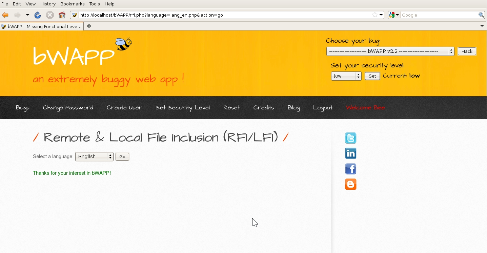

# `05` Security Misconfiguration - Local File Inclusion (LFI)

1. Select the vulnerability **Remote & Local File Inclusion (RFI/LFI)** for the guided activity and click "Hack."

    > ⚠ You may find **Remote & Local File Inclusion (RFI/LFI)** listed under Missing Functional Level Access Control since the Remote & Local File Inclusion (RFI/LFI) vulnerability can appear in multiple security categories depending on the context in which it is analyzed. Although it is more commonly classified under Security Misconfiguration, in some cases, it may be listed under categories such as Missing Function Level Access Control, as seen in bWAPP.

2. On the LFI page, you will see a URL that includes a parameter for selecting a file, for example:

    ```bash
    http://<your_ip>/bWAPP/rlfi.php?language=lan_en.php&action=go
    ```

    

    > 💡 Note that the `language` parameter is likely being used to include a language file on the page.

3. Modify the `language` parameter to attempt to include a system file. For example:

    ```bash
    http://<your_ip>/bWAPP/rlfi.php?language=../../../../etc/passwd&action=go
    ```

    When performing a Local File Inclusion (LFI) attack, the goal is to include files stored on the server (where the page you want to attack is hosted). In this case, we will try to access the `/etc/passwd` file, which is a common file on Linux servers containing information about system users. By modifying the `language` parameter, you are attempting to include a file from the server where bWAPP is running. When you place `../../../../etc/passwd` in the URL, the browser sends that request to the server, and if the LFI vulnerability exists, the server includes the content of the `/etc/passwd` file and displays it on the web page.

    

## Additional Vulnerability Exploration

Once LFI is confirmed, explore other sensitive system files. Some examples include:

- bWAPP server name:

    ```bash
    http://<your_ip>/bWAPP/rlfi.php?language=../../../../etc/hostname&action=go
    ```

- Apache main configuration:

    ```bash
    http://<your_ip>/bWAPP/rlfi.php?language=../../../../etc/apache2/apache2.conf&action=go
    ```
