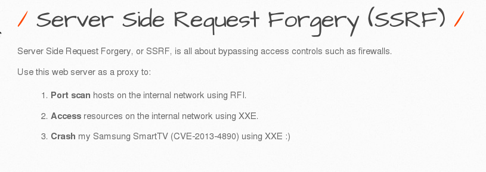
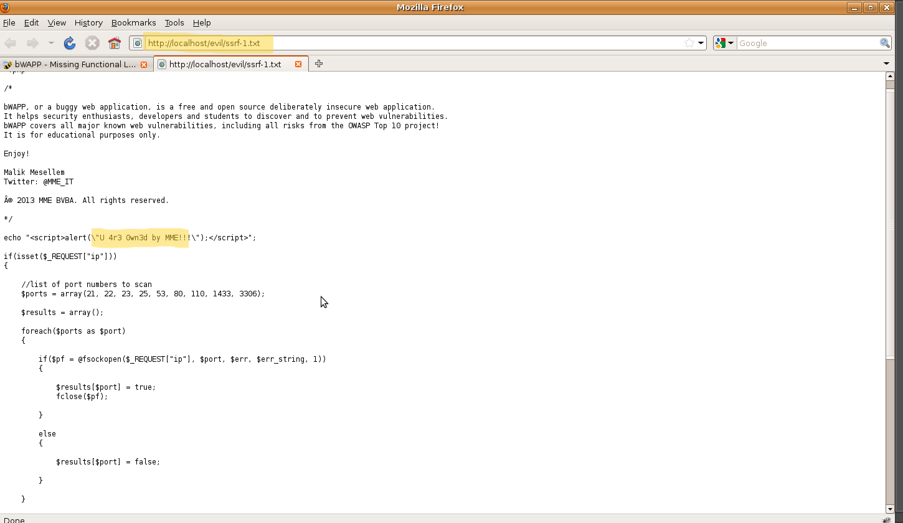

# `06` Server side request forgery - port scan

**Server-Side Request Forgery (SSRF)** es una vulnerabilidad en la que un atacante puede manipular a un servidor vulnerable para que realice solicitudes en su nombre a otros recursos, tanto internos como externos. Este comportamiento es particularmente peligroso cuando se utiliza para realizar un escaneo de puertos en la red interna. En el siguiente ejercicio combinaremos elementos de Server-Side Request Forgery (SSRF) y Remote/Local File Inclusion (RFI/LFI), para realizar un escaneo de puertos en la red interna, y utilizar la lección de RFI/LFI como vector para esta explotación.

- ### Escaneo de puertos

1. Selecciona la vulnerabilidad **Server-Side Request Forgery (SSRF)** para la actividad guiada y haz clic en "Hack".
2. Al iniciar la lección de SSRF, serás redirigido a una página que te permite realizar un escaneo de puertos en un servidor.



3. En la ventana de escaneo de puertos, ingresa una URL interna, como `http://localhost/evil/ssrf-1.txt`, para ver si el servidor puede acceder a recursos internos.

> **Nota**: En lugar de `localhost`, también puede utilizar la dirección IP o el nombre del host del servidor, como `http://localhost/evil/ssrf-1.txt` o `http://<tu-dirección-ip>/evil/ssrf-1.txt`, según la configuración de tu red y servidor.




- ### Manipulación de la lección de RFI/LFI

1. En una nueva pestaña del navegador, abre la lección de [Remote & Local File Inclusion (RFI/LFI)](../05-security-misconfiguration-LFI/README.es.md) en bWAPP. La URL será: http://localhost/bWAPP/rlfi.php

2. Haz clic en "Go" para ejecutar la funcionalidad por defecto.


- ### Explotación de SSRF mediante modificación de URL

1. En la URL resultante (http://localhost/bWAPP/rlfi.php?language=lang_en.php&action=go), elimina el valor de lang_en.php y reemplázalo por:

```bash
http://localhost/evil/ssrf-1.txt
```
> 💡 Despues de la modificación deberias tener una URL asi:  `http://localhost/bWAPP/rlfi.php?language=http://localhost/evil/ssrf-1.txt&action=go`

2. Presiona Enter para ejecutar la solicitud con la URL modificada.
3. Revisa los resultados. Si la explotación fue exitosa, verás los resultados del escaneo de puertos o cualquier otro recurso interno en la pantalla.


Observa cómo el servidor ha sido manipulado para hacer solicitudes a sí mismo o a otros servicios internos, lo que permite obtener información sobre la infraestructura. Esto te permite comprender cómo un servidor mal configurado puede ser utilizado como intermediario para acceder a recursos internos y comprometer la seguridad de una organización.


Si lograste los resultados esperados, ¡felicitaciones! ve a la siguiente leccion `-->`


